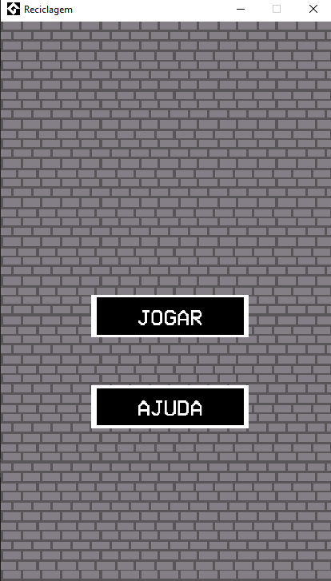

# 🌱 Projeto sobre: Reciclagem Infantil ♻️

    Este é um jogo educativo desenvolvido no Game Maker Studio 2, 
    com arte pixelada feita no Aseprite, que ensina sobre a importância da 
    reciclagem de maneira divertida e interativa.

# 🎮 Sobre o Jogo
    No Jogo da Reciclagem, o jogador é desafiado a arrastar diferentes tipos de lixo para suas respectivas 
    lixeiras antes que o tempo acabe. A cada fase, a velocidade aumenta, tornando o jogo mais desafiador e envolvente.
 ## ❗ Destaques 
    °Jogo educativo: 
    Incentiva boas práticas de reciclagem.
    °Arte em pixel art: 
    Visual vibrante e divertido, criado com Aseprite.
    °Sistema de pontuação: 
    Compita por recordes pessoais ou com amigos.

## 🛠️ Tecnologias Utilizadas
    °Game Maker Studio 2: 
    Ferramenta principal de desenvolvimento
    °Aseprite: 
    Software usado para criar a arte pixelada.
    °Android Studio: 
    Configuração do ambiente para o jogo rodar no mobile
    

## 📜 Licença

    [MIT]
    Este projeto está licenciado sob a MIT License. 
    Sinta-se à vontade para usar, modificar e distribuir, dando os devidos créditos.

## 🌟 Contribuições

    Contribuições são bem-vindas!
    Se você tiver sugestões ou encontrar algum problema, abra uma issue ou envie um pull request.
    Você também pode entrar em contato comigo pelo instagram: @daniel_d4c

## Screenshots

